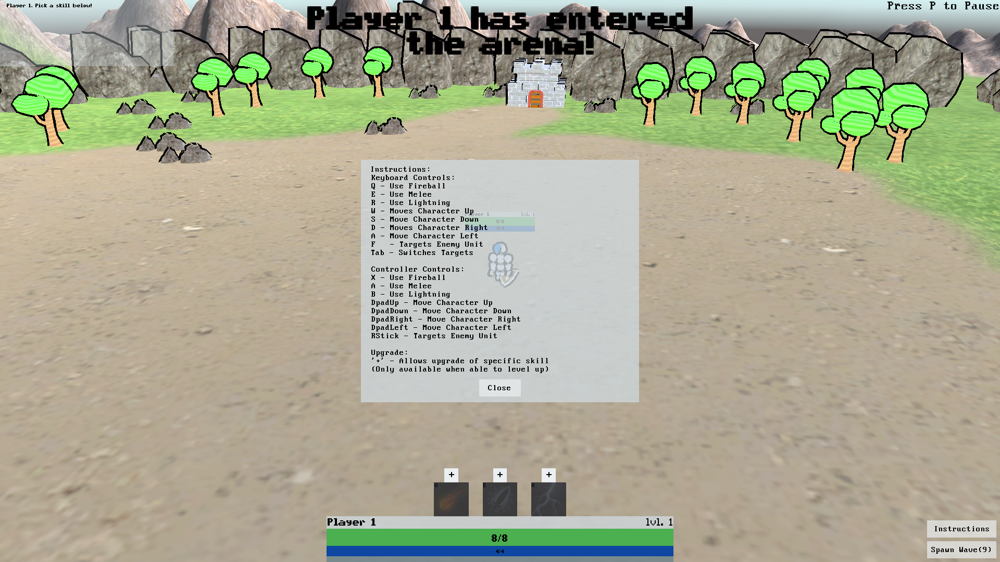

# ADGP-115
Final Assessment For Year 1

[Web Build](http://bennybroseph.github.io/ADGP-115/)

## Screenshots
### Instructions
The game's instructions shown at runtime. This does not pause the game.

### Health Bars
This shot shows the player's health bar and the player's base's health bar(the circular one). When taking damage, a red bar will be shown behind the green one. Over time, the red bar will decrease to catch up to the green one. This make the user able to better feel how much damage a unit has taken. Enemy's have this same healthbar system, except they have red bars with a deep red 'catch up' bar.

### Pick a Skill
When enough experience is gained from killing enemys using skills, the character levels up. At this point, the character gains full health and mana. They can also now pick up a new skill, or upgrade an existing one. This screenshot shows what it looks like when you hover over the '+' button to level up the fireball skill for the first time.

### Target Mode
Pressing 'f' will focus on an enemy in line of sight. Moving around will now move in a circular pattern around the targeted enemy. This was, you are always facing that enemy and the camera always has you both in view as well. This is perfect for lining up lightining or fireball shots.

